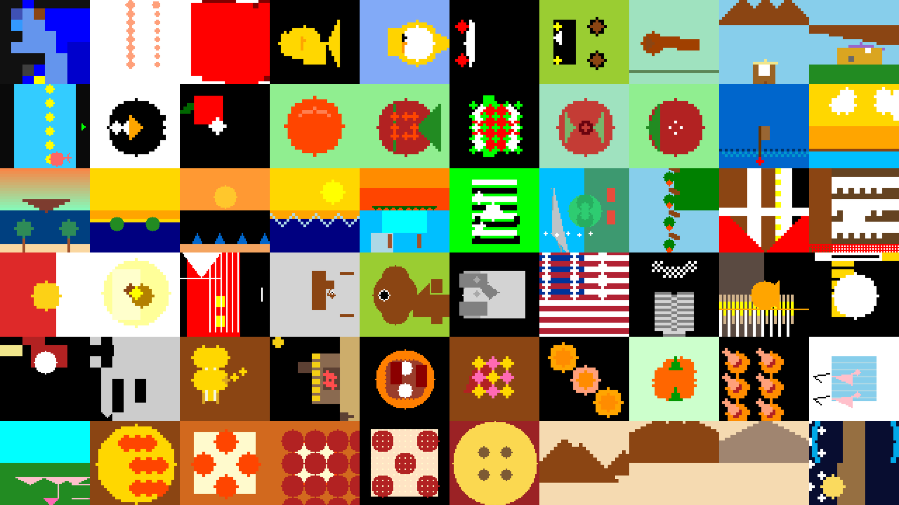

# Autoregressive Mosaics



## Overview

The idea is simple: humans are naturally great at creating mosaic art. From the Roman Empire to French Neo-Impressionism, we can effortlessly place individual strokes to form a larger, coherent image, balancing local action with global structure.

Large Language Models, however, struggle with this because they fundamentally lack spatial grounding. **Autoregressive Mosaics** is an attempt to force an LLM trained only on text to paint a picture one discrete pixel at a time. The system gives the model a blank grid (`M x N`) and a text prompt; the model must infer where to place structure and color step-by-step using only its linguistic priors.

The results are often visually primitive, unstable, or unintentionally abstract, but that is exactly the point. They offer a raw look into how text-only models represent (and fracture) geometry, shape, and visual concepts.

As with any art, outputs are open to interpretation. Squint a little: what do you see? Does the result resemble what you asked for?

## Two Generation Methods

To explore this phenomenon, the project includes two distinct generation pipelines.

### 1) ASCII Canvas (`ver2-asciicanvas`)

In this approach, the model behaves like a literal cell-by-cell painter.

- In a **single forward pass**, the LLM generates:
  - an ASCII topology grid inside `<ascii>...</ascii>`
  - a symbol-to-color map inside `<palette>...</palette>`
- Each grid cell is directly represented in text, so the model must make an explicit decision per position.
- The backend parses, sanitizes, and force-fits the result to exact `M x N` shape, then maps characters to HEX colors.

Why this fails interestingly:

- The model predicts tokens in a strict 1D sequence.
- 2D consistency (object boundaries, symmetry, position memory) is hard to sustain over long generations.
- Shapes can drift, tear, collapse, or mutate across rows, producing fragmented but often compelling abstractions.

### 2) Code Canvas (`ver3-codecanvas`)

In this approach, the model behaves like a mosaic artist who writes code.

- Instead of raw pixels, the LLM outputs Python rendering logic (`render(canvas)`).
- The code uses a constrained drawing API (`fill`, `set_pixel`, `rect`, `line`, `circle`, `triangle`).
- A deterministic renderer executes that code and rasterizes the final grid.

Why this performs better:

- The model can express intent in compact symbolic form ("draw a circle at center") rather than committing to every cell token.
- Deterministic geometry handles exact spatial bookkeeping.
- This aligns with LLM strengths: symbolic decomposition, procedural logic, and code synthesis.
- The result is a neuro-symbolic pipeline: language model for high-level plan, strict engine for spatial execution.

## Repository Layout

- `ver2-asciicanvas/` - ASCII topology + palette generation backend and UI.
- `ver3-codecanvas/` - Code-generation neuro-symbolic backend and UI.
- `results/` - Sample outputs, visualization script, and project banner.
- `backend.py`, `index.html` - earlier root-level prototype files.

## Quick Start

### Requirements

- Python 3.10+
- PyTorch + Transformers stack
- GPU recommended for Qwen 14B

Install typical dependencies in your environment (example names may vary by setup):

```bash
pip install fastapi uvicorn torch transformers accelerate
```

### Run ASCII Canvas (ver2)

```bash
cd ver2-asciicanvas
python backend.py
```

Then open: `http://localhost:8123`

### Run Code Canvas (ver3)

```bash
cd ver3-codecanvas
python backend.py
```

Then open: `http://localhost:8123`

Note: both versions default to port `8123`, so run one backend at a time.

## What This Project Is (and Is Not)

- This is not a production image generator.
- This is an interpretability-flavored art experiment probing the boundary between text autoregression and spatial reasoning.
- Failures are part of the signal, not just noise.

