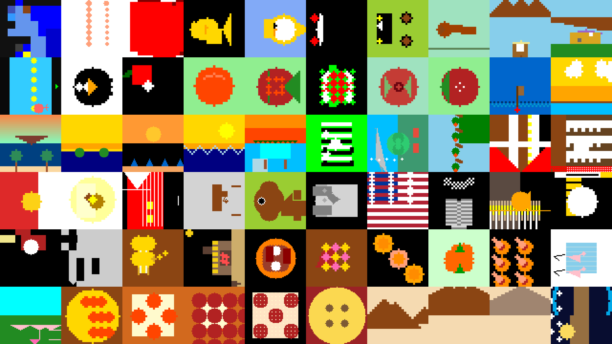

# Autoregressive Mosaics

**Probing 2D Spatial Reasoning in Text-Only Language Models**

Ashwin Nedungadi · Stefan Oehmcke · Stefan Lüdtke

Institute for Visual & Analytic Computing (VAC), University of Rostock

[Paper](https://arxiv.org/abs/2608.30751) · [Project page](https://ashwin-ned.github.io/autoregressive-mosaics/) · [Poster](assets/Autoregressive_Mosaics_A0.pdf) · [Prototype demo](https://huggingface.co/spaces/ashnedungadi/AutoregressiveMosaics)



## AM-Bench

How well can text-only language models compose 2D layouts, how does the output medium affect this ability, and what spatial information do they represent before drawing?

AM-Bench separates two tasks on a deterministic 24 × 24 canvas:

- **Translation:** turn fully specified geometry into drawing code, evaluated against exact references with part-wise intersection-over-union (PIoU).
- **Layout:** compose an arrangement from an underspecified prompt, evaluated by two vision-language judges on fidelity, shape, color, spatial arrangement, and completeness.

The study evaluates eight open-weight models (8B–34B) across four families. The layout evaluation covers 150 prompts in three tiers and 13,200 generation attempts.

## Findings

- **Geometry is easier than composition.** All eight models achieve a median translation PIoU of 1.0, while layout performance varies substantially.
- **The medium matters.** SVG improves pooled layout scores by 0.37 points on a 0–5 scale over the custom Python API at matched resolution (95% CI: 0.26–0.47).
- **Coarse layout information is decodable before generation.** Probes beat a text baseline in all eight models. A two-model analysis recovers shared layout structure but not model-specific output layouts, consistent with incremental construction.

These findings concern coarse, code-generated images. See the paper for evaluation details, controls, and limitations.

## Repository

This repository hosts the project website and earlier exploratory prototypes. The gallery and demo are prototype outputs, separate from the paper’s benchmark evaluation.

- `index.html`, `style.css`, `main.js`: project website.
- `assets/`: downloadable poster.
- `gallery_images/`, `results/`: prototype outputs and visual assets.
- `ver2-asciicanvas/`: ASCII grid and color-palette prototype.
- `ver3-codecanvas/`: Python drawing-code prototype.

Both prototypes use `Qwen/Qwen2.5-14B-Instruct`; this is distinct from the paper’s eight-model benchmark roster.

## Run locally

Preview the static website:

```bash
python -m http.server 8000
```

Open `http://localhost:8000`.

To run a prototype, use Python 3.10+ and a suitable GPU for the 14B model:

```bash
pip install fastapi uvicorn torch transformers accelerate
cd ver2-asciicanvas  # or ver3-codecanvas
python backend.py
```

Open `http://localhost:8123`. Run one prototype at a time; both use the same port.

## Citation

```bibtex
@misc{nedungadi2026autoregressivemosaics,
  title = {Autoregressive Mosaics: Probing 2D Spatial Reasoning in Text-Only Language Models},
  author = {Nedungadi, Ashwin and Oehmcke, Stefan and Lüdtke, Stefan},
  year = {2026},
  eprint = {2608.30751},
  archivePrefix = {arXiv},
  primaryClass = {cs.AI},
  url = {https://arxiv.org/abs/2608.30751}
}
```

## Copyright and License

**Copyright © 2026. All Rights Reserved.**

This code is provided for viewing purposes only in conjunction with the CVPR art gallery. Copying, modification, distribution, and derivative works without citations are prohibited.
